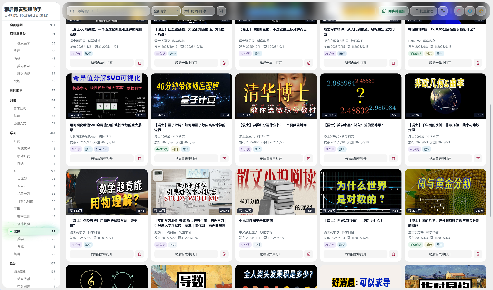

# 稍后再看整理助手

当前版本：1.3.0

## 1.3.0 更新

本次集中更新视觉与交互，使用浅灰背景、贴边封面和白色圆角视频卡片，统一顶栏、设置与手动分类面板的磨砂玻璃风格。

- 分类侧栏采用紧凑列表、循环滚动与 24 组柔和光效；选中玻璃平滑移动，文字与数量保持清晰。
- 顶栏整合搜索、同步、批量管理与 B站入口；设置按视频分类、分类目录、API 与自动化分区，切换时保留草稿。
- 分类切换、搜索、乱序及删除使用平滑过渡；支持系统“减少动态效果”，操作反馈自动消失并保存在本机日志。
- 更新界面封面与 1280×800 展示图；保留初步分类、AI 分类和手动确认的清晰标识。

升级本身不重新处理已有视频，不替换分类目录，也不覆盖手动确认的视频分类。AI 分类仅在主动启动或明确开启自动分类后运行。

这是一个给屯屯鼠准备的 B站稍后再看分类插件。它会把越攒越多的稍后再看视频整理成清晰的分类目录，让你更快找到真正想看的内容，而不是继续在长长的列表里翻找。

插件可以先在本地完成快速的初步分类，也支持使用 AI 进一步批量分类，以及手动确认重要视频。手动确认的结果优先级最高，不会被后续的自动分类覆盖。

## 主要功能

- 同步 B站稍后再看列表，并补充视频标题、UP 主、分区等信息。
- 按分类目录、时长和播放进度浏览、搜索和筛选视频。
- 在本地进行初步分类，不需要配置 API。
- 使用 OpenAI-compatible API 或 Jev（TypeSafe）进行 AI 批量视频分类。
- 通过复制 Prompt、导入 JSON 的方式使用 ChatGPT、Gemini 等 AI，无需提供 API Key。
- 单个或批量手动调整视频分类。
- 从稍后再看中移出不需要的视频；重新读取 B站列表确认移除后才提示成功，失败时恢复显示。
- 删除时可在后台加载已有但尚未加载的 B站标签页，无需手动切换页面。

## 使用 Jev 分类视频

1. 在“设置 → API 设置”将“视频分类使用的 API”选为 **Jev（TypeSafe）**，页面只显示对应配置及简短介绍。
2. 填入 TypeSafe API Key，模型默认 `jev-latest`，点击“测试 Jev”，通过后点击“保存并使用 Jev”。两种 API 的配置独立保留，切换不会清空。
3. 在“AI 批量视频分类”设置本次最多处理 **5** 个视频，然后开始分类。

Jev 从现有目录中为每个视频选择一个类别，每批最多 5 个，支持手动启动及每天、每周、按数量自动触发。启用分类最多 255 个；超过时会提示调整目录。手动确认的视频始终跳过，已有视频仅在启动分类或开启自动分类后处理。结果不确定或暂未归类的视频仍在“待精细分类”中，同一轮只尝试一次。

分类目录生成继续使用单独保存的 OpenAI-compatible 配置。Jev 的密钥只发送到 TypeSafe，不会作为其他服务的密钥使用。测试会发送内置示例，实际分类会发送标题、UP 主、分区、标签、简介、分P标题及分类目录。

根据 [TypeSafe 模型说明](https://docs.typesafe.ai/models)，中文效果需要在自己的视频上验证；建议先检查这 5 个结果再扩大数量。[接口说明](https://docs.typesafe.ai/api)记录了 Choice 格式和 255 个选项的限制。

## 安装

### Microsoft Edge 插件商店

正式版已经可以在 Microsoft Edge 插件商店下载。在 Edge 插件商店搜索 **“稍后再看整理助手”** 即可安装。

> GitHub 源码已更新至 `v1.3.0`；插件商店与 GitHub Release 的版本可能不同，请以各下载页面为准。

### GitHub Release 手动安装

Chrome 用户或需要提前体验审核中版本的用户，可以通过“加载已解压的扩展程序”安装：

1. 在 GitHub 的 Releases 页面下载最新的 `bili-watchlater-organizer-edge-*.zip`，并解压到一个固定文件夹。不要直接选择 ZIP 文件，也不要选择解压后外层的空文件夹。
2. 在 Chrome 中打开 `chrome://extensions/`，或在 Edge 中打开 `edge://extensions/`。
3. 开启页面右上角的“开发者模式”。
4. 点击“加载已解压的扩展程序”，选择包含 `manifest.json` 的项目文件夹。
5. 登录 B站，然后点击浏览器工具栏中的插件图标。

### 从 Release 更新并重新加载

1. 下载新版本 ZIP 并解压。
2. 用解压后的文件替换当前已加载扩展文件夹中的内容；替换后该文件夹的第一层应直接包含 `manifest.json`、`src`、`icons` 和 `_locales`。
3. 回到 `chrome://extensions/` 或 `edge://extensions/`，在“稍后再看整理助手”卡片上点击“重新加载”。
4. 如果浏览器提示找不到扩展文件夹，请点击“加载已解压的扩展程序”，重新选择包含 `manifest.json` 的文件夹。

不要随意移动或删除当前已加载的扩展文件夹，否则浏览器将无法继续加载插件。

## 首次使用

首次打开“稍后再看整理助手”后，按页面引导完成以下设置：

1. 确认当前浏览器已登录 B站，插件会同步你的稍后再看列表。
2. 设置分类目录。你可以直接使用默认目录、手动编辑目录、让 AI 生成目录，或导入 AI 生成的目录。
3. 选择整理方式：手动调整视频分类，或在“AI 批量视频分类”中选择 API 自动分类、手动导入/导出。

分类目录决定“有哪些分类”；视频分类决定“每个视频放在哪里”。生成或编辑分类目录不会自动完成全部视频的 AI 分类。

插件中的分类分为三种：

- **初步分类**：插件根据标题、分区等信息在本地快速判断，适合先把大量视频粗略整理起来。
- **AI 分类**：AI 阅读视频信息后进行更细致的判断。
- **手动确认**：由你亲自保存，优先级最高，不会被自动流程覆盖。

## 日常使用

点击浏览器工具栏图标，或点击 B站首页右侧的蓝色圆形入口，即可打开整理助手。

- 左侧分类目录用于浏览不同类别的视频。
- “待精细分类”会集中显示只有初步分类、结果过旧、结果不确定或分类异常的视频。
- “其他 / 暂未归类”是没有合适归属时使用的内容类别，旧名称为“待整理”；它与“待精细分类”这一处理状态可以重叠。例如，初步归入科技的视频仍待精细分类；手动确认放在暂未归类的视频则不再待精细分类。本次只修正默认兜底类别的旧名称，不改变视频归属或手动确认结果。
- 顶部“同步并更新”用于获取最新的稍后再看列表和缺失的视频信息。
- 点击视频封面可打开普通视频页；点击“稍后合集中打开”可进入 B站稍后再看播放上下文。
- 点击视频卡片可展开“手动调整视频分类”。
- 点击视频卡片上的删除图标后，视频会立即从列表隐藏；插件会在后台向 B站确认，失败时自动恢复并提示原因。

## 批量管理

需要一次整理多个视频时：

1. 点击顶栏中的“批量管理”。
2. 点击视频卡片逐个选择，或在视频区域拖拽框选多个视频。
3. 选择要添加、移除或替换的分类。
4. 确认批量操作并保存。

你也可以在同一张“AI 批量视频分类”卡片中使用两种方式：

- **AI (API) 批量视频分类**：先在可折叠的“设置”中填写并测试 API URL、模型和 API Key，再设置每批数量后直接运行。分类目录生成共用这组配置，配置保存在扩展本地存储中。
- **AI (手动导入/导出) 批量视频分类**：生成 Prompt，复制给 ChatGPT 或 Gemini，再将 AI 返回的 JSON 粘贴回插件导入。

“设置”中的 API 设置和自动 API 视频分类设置可以分别折叠。自动分类支持关闭、每天、每周，或在待精细分类达到指定数量时触发；浏览器需要保持运行，实际触发时间可能稍有延迟。

批量自动分类会跳过手动确认的视频，失败的批次也不会清空已经成功保存的结果。

## 数据与隐私

- 视频信息、分类结果和处理队列保存在扩展自己的 IndexedDB 中。
- 设置、分类目录和 AI API 配置保存在 `chrome.storage.local` 中。
- 插件不会保存 B站 Cookie，不会上传浏览历史，也不会保存视频封面文件。
- 初步分类完全在本地运行，不调用外部 AI 服务。
- 只有在你主动使用 AI 分类，或明确开启自动 API 视频分类后，所选 API 服务才会收到分类所需的视频文本信息。
- 卸载插件通常会同时删除扩展本地数据，请在卸载前自行确认是否需要保留重要设置。

## 使用提示

- 如果同步失败，请先确认当前浏览器已登录 B站，再重新打开整理助手。
- 如果 AI 分类失败，请检查 API URL、模型名称、API Key 和服务余额。
- 不同 AI 服务对 JSON 输出格式的支持不同；遇到兼容问题时，可以关闭“请求 JSON response_format”后重试。
- 本项目与哔哩哔哩官方无关，B站页面或接口变化可能影响部分功能。
